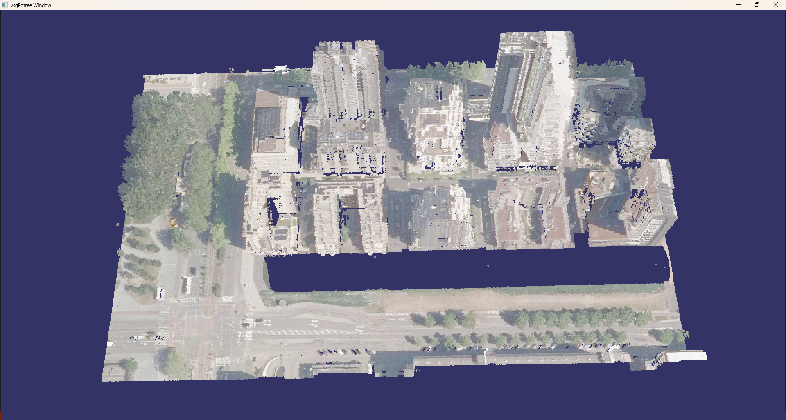

# vsgPotree

vsgPotree 是基于 [VulkanSceneGraph](https://github.com/vsg-dev/VulkanSceneGraph.git)开发的插件，能够直接加载由 [PotreeConverter 2.0](https://github.com/potree/PotreeConverter.git)生成的点云数据，为 VSG 用户提供了便捷的大体量点云渲染支持。
本代码库包含用于构建 vsgPotree 库的 C++ 头文件、源文件以及 CMake 构建脚本。当前至少依赖VulkanSceneGraph(Vulkan、glslang)。与VulkanSceneGraph一致，该软件支持在Linux、Windows、Android、macOS下构建。

## osgPotree 构建快速指南

### 环境准备:
* 必要: 支持 C++17 标准的编译器，例如 g++ 7.3 或更高版本、Clang 6.0 或更高版本、Visual Studio 2017 或更高版本。
* 必要： [CMake](https://www.cmake.org) 3.7或以后。
* 必要： [VulkanSceneGraph](https://github.com/vsg-dev/VulkanSceneGraph.git) 1.1.15及以后。
* 必要： [Vulkan](https://vulkan.lunarg.com/) 1.1或以后

以上列出的依赖版本均为经验证可用的版本，因此被设定为当前的最低要求。使用更早的版本进行构建也有可能成功。若您使用更旧的版本成功完成构建，请告知我们，以便更新版本信息。

### 命令行编译指南:

在源码目录中构建并安装osgPotree 库，以windows 11下为例，首先下载[编译好的三方库](https://pan.baidu.com/s/1O-zKtnuPs-yl5-s9Glj7OQ?pwd=shtn)到本地并解压到当前文件夹，此时解压后的文件夹ThirdParty_VSGPOTREE包含bin、lib、include等库文件信息，接着在与ThirdParty_VSGPOTREE同级目录下运行如下命令

    git clone https://gitee.com/mycaB/vsg-potree.git
    cd vsg-potree
    cmake . -DCMAKE_BUILD_TYPE=Release -DTHIRD_PARTY_DIR=../ThirdParty_VSGPOTREE -DCMAKE_INSTALL_PREFIX=../ThirdParty_VSGPOTREE
    cmake --build . -j 16 -t install --config Release
## 资产
   assets文件夹，包含potree点云，会在Install过程中拷贝到安装目录。
## 特性
在安装目录bin文件夹下，以cmd模式运行。
### 大体量点云显示:
    vsgviewer ../assets/PointExtractor.potree
